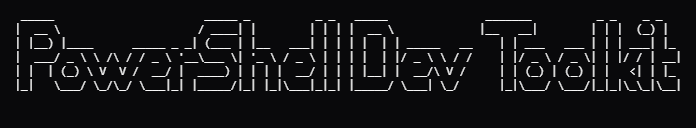

<p align="center">
  
</p>

# PowerShell Dev Toolkit for Windows

> A comprehensive collection of PowerShell productivity scripts for Windows developers. Streamline your development workflow with SSH tunneling, project management, AI integration, and much more.

[Windows](https://www.microsoft.com/windows)
[PowerShell](https://docs.microsoft.com/powershell/)
[License](LICENSE)

## Features

- **SSH Management** - Easy SSH connections and database tunneling with credential management
- **Development Tools** - Auto-detecting dev servers, port management, project detection
- **Code Search** - Fast project-wide search with smart filtering
- **Git Integration** - Enhanced git status and branch information
- **AI Assistant Integration** - Generate AI rules files for Cursor IDE, Claude, and other AI coding assistants
- **Log Monitoring** - Real-time log file watching with filtering
- **Quick Commands** - 30+ productivity commands with short aliases

## Quick Start

### Option A: Install from PowerShell Gallery (recommended)

```powershell
# Install the module
Install-Module PowerShellDevToolkit -Scope CurrentUser

# Or using the newer PSResourceGet
Install-PSResource PowerShellDevToolkit

# Import it (add this line to your $PROFILE to load automatically)
Import-Module PowerShellDevToolkit

# Verify installation
Get-Command -Module PowerShellDevToolkit
helpme
```

### Option B: Install from source

1. **Clone the repository**
  ```powershell
   git clone https://github.com/joshuaevan/powershell-dev-toolkit.git
   cd powershell-dev-toolkit
  ```
2. **Run the setup script**
  ```powershell
   .\Setup-Environment.ps1
  ```
3. **Configure your settings**
  ```powershell
   Copy-Item config.example.json config.json
   notepad config.json
  ```
4. **Reload your profile**
  ```powershell
   . $PROFILE
  ```

## Requirements

### Essential

- **Windows 10/11**
- **PowerShell 5.1+** (comes with Windows)
- **Git** - [Download](https://git-scm.com/download/win)

### Recommended

- **WSL (Windows Subsystem for Linux)** - For better SSH support
  ```powershell
  wsl --install
  ```
- **Notepad++** - For quick file editing - [Download](https://notepad-plus-plus.org/)

### Optional (Install as needed)

- **Node.js & npm** - For JavaScript/Node projects - [Download](https://nodejs.org/)
- **PHP** - For PHP/Laravel projects - [Download](https://windows.php.net/download/)
- **Python** - For Python projects - [Download](https://www.python.org/downloads/)
- **Composer** - For PHP dependency management - [Download](https://getcomposer.org/)

## Key Commands

### SSH & Remote Access

```powershell
cssh myserver                    # SSH to server
tunnel myserver postgres         # PostgreSQL tunnel (port 5432)
tunnel myserver mysql 3307       # MySQL tunnel with custom local port
```

### Development

```powershell
serve                            # Auto-detect & start dev server
serve -Port 8080                 # Custom port
port 3000                        # Check what's using port 3000
port 3000 -Kill                  # Kill process on port
search "function login"          # Search codebase
gs                               # Pretty git status
```

### Project Management

```powershell
context                          # Generate project summary
context -Copy                    # Copy to clipboard
proj                             # Detect project type
useenv                           # Load .env file
```

### AI Integration

```powershell
ai-rules php                     # Generate .airules for PHP (default)
ai-rules laravel -RuleType Cursor   # Generate .cursorrules for Laravel
ai-rules react -RuleType Claude     # Generate .clauderules for React
ai-rules -Auto                   # Auto-detect project type
```

### File & Directory

```powershell
e .\file.ps1 -Line 42           # Edit in Notepad++
touch .\newfile.txt              # Create file or update timestamp
ll                               # Enhanced directory listing
la                               # List all including hidden
mkcd new-project                 # Create dir and cd into it
open .\document.pdf              # Open with default app
```

### Utilities

```powershell
which node                       # Find command location
sudo notepad hosts               # Run as administrator
reload                           # Reload PowerShell profile
grep "pattern" *.ps1             # Search text in files
ip                               # Show IPv4 addresses
tail .\app.log -Filter "error"   # Watch and filter logs
rc -Interactive                  # Browse command history
```

## Full Command Reference

Run `helpme` to see all commands, or check the [complete documentation](docs/COMMANDS.md).

## Configuration

### SSH Setup

1. **Configure servers in `config.json`:**
  ```json
   {
     "ssh": {
       "credentialFile": "ssh-credentials.xml",
       "servers": {
         "myserver": {
           "hostname": "server.example.com",
           "description": "Production server"
         },
         "aws-server": {
           "hostname": "ec2-xxx.amazonaws.com",
           "description": "AWS EC2 instance",
           "keyFile": "aws-key.pem"
         }
       }
     }
   }
  ```
2. **Store SSH credentials (password auth):**
  ```powershell
   # Create creds directory
   New-Item -Path ".\creds" -ItemType Directory -Force

   # Store encrypted credentials
   $cred = Get-Credential -UserName 'your-ssh-username'
   $cred | Export-Clixml '.\creds\ssh-credentials.xml'
  ```
3. **Or use key file authentication (.pem):**
  ```powershell
   # Copy your key file to creds directory
   Copy-Item 'C:\path\to\your-key.pem' '.\creds\your-key.pem'

   # Still need credential file for username
   $cred = Get-Credential -UserName 'ec2-user'
   $cred | Export-Clixml '.\creds\ssh-credentials.xml'
  ```

### Editor Integration

Configure your preferred editor in `config.json`:

```json
{
  "editor": {
    "notepadPlusPlus": "C:\\Program Files\\Notepad++\\notepad++.exe"
  }
}
```

## Customization

### Module Structure

The toolkit is organized as a standard PowerShell module:

```
PowerShellDevToolkit/
  PowerShellDevToolkit.psd1   # Module manifest (version, exports)
  PowerShellDevToolkit.psm1   # Root module (auto-loader)
  Public/                     # Exported functions (one per file)
  Private/                    # Internal helpers (not exported)
```

### Adding Custom Commands

1. Create a new `Verb-Noun.ps1` file in `PowerShellDevToolkit\Public\`
2. Wrap your code in a function with the same name
3. Add the function name to `FunctionsToExport` in the `.psd1`
4. Optionally add an alias in the `.psm1` and `AliasesToExport` in the `.psd1`
5. Run `Import-Module .\PowerShellDevToolkit -Force` to reload

### Extending SSH Servers

Edit `config.json` to add more servers:

```json
"servers": {
  "prod": {
    "hostname": "prod.example.com",
    "description": "Production"
  },
  "staging": {
    "hostname": "staging.example.com", 
    "description": "Staging"
  },
  "aws": {
    "hostname": "ec2-xxx.amazonaws.com",
    "description": "AWS EC2",
    "keyFile": "aws-key.pem"
  }
}
```

> **Note:** For key file auth, place `.pem` files in `.\creds\` and set `keyFile` in config.

## Testing

Run the full test suite locally with one command:

```powershell
.\Invoke-Tests.ps1
```

Tests also run automatically on every push and pull request via GitHub Actions CI.

## Documentation

- [Complete Command Reference](docs/COMMANDS.md)
- [SSH Configuration Guide](docs/SSH-SETUP.md)
- [Troubleshooting](docs/TROUBLESHOOTING.md)
- [Contributing Guidelines](CONTRIBUTING.md)

## Contributing

Contributions are welcome! Please feel free to submit a Pull Request. For major changes:

1. Fork the repository
2. Create your feature branch (`git checkout -b feature/AmazingFeature`)
3. Commit your changes (`git commit -m 'Add some AmazingFeature'`)
4. Push to the branch (`git push origin feature/AmazingFeature`)
5. Open a Pull Request

## Troubleshooting

### Scripts won't execute

```powershell
Set-ExecutionPolicy -ExecutionPolicy RemoteSigned -Scope CurrentUser
```

### SSH commands not working

1. Check if WSL is installed: `wsl --version`
2. If not, install Posh-SSH: `Install-Module -Name Posh-SSH`
3. Verify credentials file exists: `Test-Path .\creds\ssh-credentials.xml`

### Missing commands after setup

```powershell
# Reload your profile
. $PROFILE

# Or rerun setup
.\Setup-Environment.ps1 -UpdateProfile
```

## License

This project is licensed under the MIT License - see the [LICENSE](LICENSE) file for details.

## Acknowledgments

- Built for developers who love PowerShell or Have no choice but to use it
- Inspired by Unix productivity tools
- Optimized for Windows 10/11 development environments

## Support

- **Issues**: [GitHub Issues](https://github.com/joshuaevan/powershell-dev-toolkit/issues)
- **Discussions**: [GitHub Discussions](https://github.com/joshuaevan/powershell-dev-toolkit/discussions)

---

**Made for Windows developers**

*Star this repo if you find it helpful!*